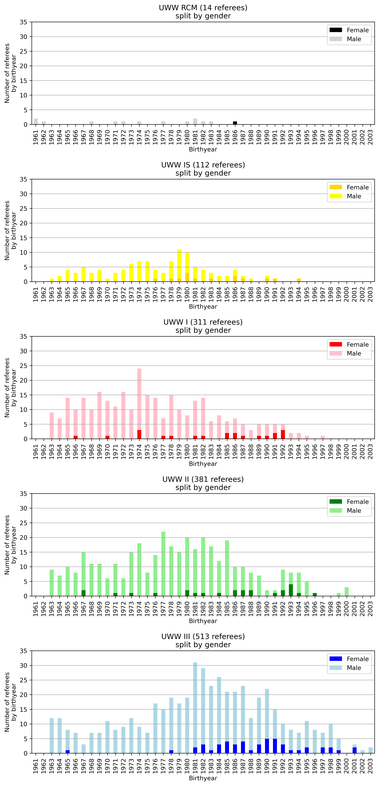

# International Referees' Information Extractor

Python script scraping the UWW international referee information from the Athena system.

## Requirements

Install the python requirements:

    pip install -r requirements.txt

## Running

Run the script like so:

    python int_referees.py

This script produces the file `int_referees.csv`, the result of the parsing/scraping, and `list.pdf`, which is the official referees' list downloaded from the UWW website.

The scraping takes a while: the requests were not parallelized to avoid DoSing the Athena system/being IP-banned.

All the referee information is extracted from Athena, so everything is up to date. The PDF file is only there to provide the license numbers.

## Basic graphs

To get basic statistic graphs, run the following file:

    python graph.py

which creates several image files in the folder `img`.

You can concatenate them into one image using imagemagick and the `img/concatenate.sh` script.
You get the following result:

